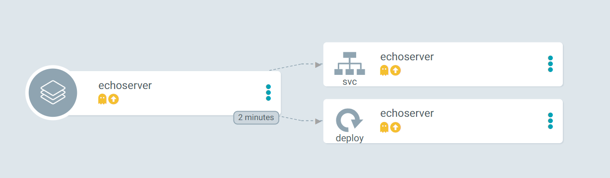

# ArgoCD KPT Configuration Management Plugin

This repo contains an example implementation of [kpt](https://kpt.dev/) as
[ArgoCD](https://argo-cd.readthedocs.io/en/stable/) configuration management
plugin. The source for the CMP is in the [plugin directory](./plugin/). A
`kustomize` component to patch the `ArgoCD` repo server can be found in the
[configuration directory](./configuration/component/).

## Quick Start

Below commands will deploy the stable ArgoCD stack into your cluster, in the
argocd namespace, including the component patch to run kpt as CMP sidecar. Make
sure you don't run this in your production cluster or somewhere where you have
already ArgoCD configured.

```bash
kustomize build configuration/ -o .out/
```

Once you have generated the manifests to the [.out](./.out/) folder, you can review the
[repo server manifest](./.out/apps_v1_deployment_ArgoCD-repo-server.yaml) to see
how the plugin is integrated.

If you want, you can apply the manifests to your cluster.

```bash
kubectl create namespace argocd
kubectl apply -f .out/
```

If you want to add the component to your existing configuration, review the
component and integrate it into your own configuration.

For example you could add the component as [remote
target](https://github.com/kubernetes-sigs/kustomize/blob/master/examples/remoteBuild.md)
to your existing kustomization.

```yaml
apiVersion: kustomize.config.k8s.io/v1beta1
kind: Kustomization
namespace: argocd
resources:
  - https://raw.githubusercontent.com/argoproj/argo-cd/stable/manifests/install.yaml
components:
  - https://github.com/bluebrown/argocd-cmp-kpt//configuration/component/?rev=main
images:
  - name: index.docker.io/bluebrown/argocd-cmp-kpt
    newTag: v1.0.0-beta.21
```

## The Concept

ArgoCD comes with a few configuration management tools build in. At the time of
writing, these are `helm`, `kustomize` and `jsonnet`. However, it is possible to
configure your own CMP (configuration management plugin).

The basic idea is that ArgoCD will not sync raw manifests directly to the
cluster but invoke one of the included tools or user provided CMPs to obtain the
final yaml manifests that should be synced to the cluster. For example, one
could use helm to render a chart using the `helm template` command.

Kpt is a tool to manage so called packages, which are collections of kubernetes
manifests. The goal of this project is to integrate kpt as CMP such that it will
produce the yaml manifests and have ArgoCD sync them to the cluster.

There are a few challenges which come along with this. This repo aims to provide
only exemplary solutions to those, with room for improvement.

The first challenge is to use kpt to output the final manifests instead of
relying on its `live` mechanism. This is because ArgoCD should decide wether the
cluster state is in sync with the produced yaml or not. This can be solved
relatively easy by using its `unwrap` output option. Before outputting the
manifests any local configs, including the `Kptfile` itself, are removed using
the [remove-local-config-resource
function](https://catalog.kpt.dev/remove-local-config-resources/v0.1/).

```bash
kpt fn eval --exec remove-local-config-resources-v0.1.0 --output unwrap
```

The second and greater challenge is actually the function management. This is
because kpt usually works by running each function in container. This
architecture is tricky to realize when running kpt as a CMP sidecar. The
workaround presented here is to use `exec` instead of `image`, which allows to
use local executables as functions. You can actually see an example of this in
the above code snippet. However, this comes with a number of problems around the
availability and versioning of the functions. These problems have been naively
solved by including some common functions in the CMP image. That means kpt
packages deployed in this fashion are limited in the functions and versions they
can use. One can imagine more elaborate setups to spawn containers to run the
functions, or fetch the executables on demand.

```dockerfile
COPY --from=gcr.io/kpt-dev/kpt:v1.0.0-beta.21 /usr/local/bin/kpt /usr/local/bin/kpt
COPY --from=gcr.io/kpt-fn/remove-local-config-resources:v0.1.0 /usr/local/bin/function /usr/local/bin/remove-local-config-resources-v0.1.0
COPY --from=gcr.io/kpt-fn/set-annotations:v0.1.4 /usr/local/bin/function /usr/local/bin/set-annotations-v0.1.4
```

## Hands On

In order to build the CMP we need a few ingredients:

- A container image containing kpt and common functions
- A plugin configuration
- A script to use as generate command
- A patch for the ArgoCD repo server to inject the CMP sidecar

### The Plugin Config

This configuration will be used by the `cmp-server` to register the plugin with
`repo-server`. Every time the repo server finds a file matching the discovery
criteria it will delegate the production of the final yaml manifests to the
plugin.

```yaml
apiVersion: argoproj.io/v1alpha1
kind: ConfigManagementPlugin
metadata:
  name: kpt
spec:
  version: v1.0
  discover:
    fileName: Kptfile
  lockRepo: true
  generate:
    command:
      - cmp-generate
```

### The Generate Script

This script will run inside the configured [argo application
path](https://argo-cd.readthedocs.io/en/stable/operator-manual/declarative-setup/#applications)
every time ArgoCD detects changes to the upstream repository. It will use kpt to
emit the desired kubernetes manifests and let ArgoCD decide what and how it
should be synced.

You may notice this hackish `find + sed` combination. This is to replace all
`image` references in all `Ktpfiles` with `exec` references so that the local
binaries included in the image will be used, when issuing the `kpt fn render
--allow-exec` command.

```bash
#!/bin/bash

set -euo pipefail

# the prefix is used to annotate the resources with
# the ArgoCD build environment
: "${ANNOTATION_DOMAIN:=argocd.my-org.io}"

# replace all image refs with exec refs, in Ktptfile pipelines
# this could be more solid, perhaps writing a custom fn to exec ;)
find . -name Kptfile -print0 |
    xargs -0 --no-run-if-empty \
        sed --in-place -E 's|image:.+/(.+):(.+)|exec: \1-\2|'

# render the configuration with the Kptfile pipelines
kpt fn render --allow-exec

# Set annotations from the ArgoCD environment
kpt fn eval --exec set-annotations-v0.1.4 -- \
    "$ANNOTATION_DOMAIN/app=$ARGOCD_APP_NAME" \
    "$ANNOTATION_DOMAIN/rev=$ARGOCD_APP_REVISION" \
    "$ANNOTATION_DOMAIN/repo=$ARGOCD_APP_SOURCE_REPO_URL" \
    "$ANNOTATION_DOMAIN/branch=$ARGOCD_APP_SOURCE_TARGET_REVISION" \
    "$ANNOTATION_DOMAIN/path=$ARGOCD_APP_SOURCE_PATH"

# Lastly, emit the final config by using the remove-local-config-resources
# function which strips all local configs including Kpt files, from the output
kpt fn eval --exec remove-local-config-resources-v0.1.0 --output unwrap
```

### The Dockerfile

It is crucial to create a user with the id 999 since that is the user id inside
the ArgoCD repo server. This is very important because the entrypoint of the
sidecar will be ultimately the mounted `argocd-cmp-server` binary which listens
on a socket. This socket will be accessible for the repo server through a shared
volume. In order for the two programs to communicate, the repo server must have
write permission on the socket. This is ensured by using the same uid 999. This
will make more sense further down, when we get to the patch.

```dockerfile
FROM alpine

# git is required by kpt and bash is used to have
# a more solid script since pipefail is available
RUN apk --no-cache add git bash

# its important to use the id 999 since the ArgoCD repo server user will write
# to the the socket file created by the mounted entrypoint
RUN adduser --system --disabled-password --gecos "" --shell /bin/bash --uid 999 argocd

# add the kpt binary which is the core piece of this cpm as  well a some functions.
# remove-local-config-resources is required to make it all work since it allows to purge local configs.
# set-annotations is used to annotate the rendered config with the ArgoCD app name and environment
COPY --from=gcr.io/kpt-dev/kpt:v1.0.0-beta.21 /usr/local/bin/kpt /usr/local/bin/kpt
COPY --from=gcr.io/kpt-fn/remove-local-config-resources:v0.1.0 /usr/local/bin/function /usr/local/bin/remove-local-config-resources-v0.1.0
COPY --from=gcr.io/kpt-fn/set-annotations:v0.1.4 /usr/local/bin/function /usr/local/bin/set-annotations-v0.1.4

# add some other functions that you want to use
COPY --from=gcr.io/kpt-fn/set-image:v0.1.1 /usr/local/bin/function /usr/local/bin/set-image-v0.1.1
COPY --from=gcr.io/kpt-fn/set-labels:v0.1.5 /usr/local/bin/function /usr/local/bin/set-labels-v0.1.5

# the plugin definition can also be mounted from a config map, if **preferred**
COPY plugin.yaml /home/argocd/cmp-server/config/plugin.yaml

# the generate script is executed to render the kubernetes manifests
# as defined in the plugin.yaml
COPY --chmod=755 generate.sh /usr/local/bin/cmp-generate

WORKDIR /home/argocd
USER 999
ENTRYPOINT ["/bin/bash"]
```

### The Patch

This patch injects the CMP container as sidecar to the ArgoCD repo server. It
mounts the `var-files` volume which is already in the `argocd-repo-server` pod
spec. Through this shared volume the entrypoint
`/var/run/argocd/argocd-cmp-server` is available. And the socket created by the
entrypoint will be created in this volume so that the repo server can
communicate with the CMP server.

The CMP server does all the heavy lifting of sending the yaml back and forth
and invoking our plugin in the right directory. So our plugin only cares about
dealing with the current path containing a `Kptfile`.

```yaml
# inject the sidecar to the repo server
# ref: https://argo-cd.readthedocs.io/en/stable/user-guide/config-management-plugins/#3-register-the-plugin-sidecar
- op: add
  path: /spec/template/spec/containers/-
  value:
    name: cmp-kpt
    # change this image to your own or keep it
    # to use the one build from this repo
    image: index.docker.io/bluebrown/argocd-cmp-kpt
    command: [/var/run/argocd/argocd-cmp-server]
    securityContext:
      allowPrivilegeEscalation: false
      readOnlyRootFilesystem: true
      capabilities:
        drop:
          - ALL
    resources:
      requests:
        cpu: 10m
        memory: 32Mi
      limits:
        cpu: 1000m
        memory: 256Mi
    volumeMounts:
      # mount the var files and plugins directory
      # in order to get access to the entrypoint,
      # allow communication between cmp and repo server
      # via a socket, and register the plugin
      - name: var-files
        mountPath: /var/run/argocd
      - name: plugins
        mountPath: /home/argocd/cmp-server/plugins
      - name: cmp-tmp
        mountPath: /tmp
# create a volume for tmp files since we don't have
# write permission on the root file system
- op: add
  path: /spec/template/spec/volumes/-
  value:
    name: cmp-tmp
    emptyDir: {}
```

## Example

If you have deployed the ArgoCD server with the cmp sidecar, you can use the
resources in the [example directory](./example/). The [ArgoCD
application](./example/argo-app.yaml) will monitor the [kpt
package](./example/kpt-app/) in this repository and since there is a `Kptfile`,
it will use the CMP to render the final yaml.

The below commands provisions ArgoCD with plugin as well as the example app.

```bash
# deploy ArgoCD and CMP
kubectl create ns ArgoCD
kustomize build configuration/ | kubectl apply -f -
# create an example application
kubectl apply -f example/argo-app.yaml -n argocd
```

Once deployed, we can visit the ArgoCD UI to check on our application. Run the
below commands and then visit
<https://localhost:8080/applications/echoserver?view=tree>. Use the username
`admin` and the password you have obtained via `kubectl`.

```bash
kubectl -n argocd get secret argocd-initial-admin-secret -o jsonpath="{.data.password}" | base64 -d; echo
kubectl port-forward svc/argocd-server -n argocd 8080:443
```

We can see that ArgoCD knows about our echoserver and that its out of sync.



If we look at the service, for example, we see that the kpt CMP has added the
annotations as written in the generate script. You can also see that the
pipeline in specified in the Kptfile has been run and thus the `set-labels`
function. I would actually recommend to keep in cluster pipeline usage to a
minium though. Kpt has good support for in-place changes and updates from
upstream. So there should be little need to actually run complex pipelines in
cluster.

```yaml
apiVersion: v1
kind: Service
metadata:
  annotations:
    argocd.my-org.io/app: echoserver
    argocd.my-org.io/branch: main
    argocd.my-org.io/path: example/kpt-app/
    argocd.my-org.io/repo: 'https://github.com/bluebrown/argocd-cmp-kpt'
    ArgoCD.my-org.io/rev: f62b5a47018aadf1ff3723a05ffb7f234858fb69
  labels:
    app.kubernetes.io/instance: echoserver
    env: test
  name: echoserver
  namespace: default
spec:
  ports:
    - port: 80
      targetPort: 8080
  selector:
    app: echoserver
    env: test
```

## Clean up

```bash
kubectl delete -f example/argo-app.yaml -n argocd
kustomize build configuration/ | kubectl delete -f -
kubectl delete ns argocd
```

## Next Steps

If you like the idea and would like to develop it further. I would be glad to
collaborate. You can reach out via slack in the [kubernetes
group](https://kubernetes.slack.com/archives/D02AB567WKY) or the [cncf
group](https://cloud-native.slack.com/archives/D03BKR5584E).
